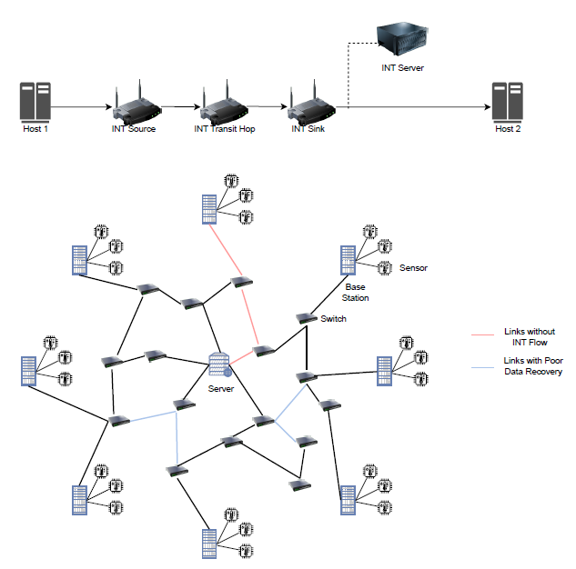
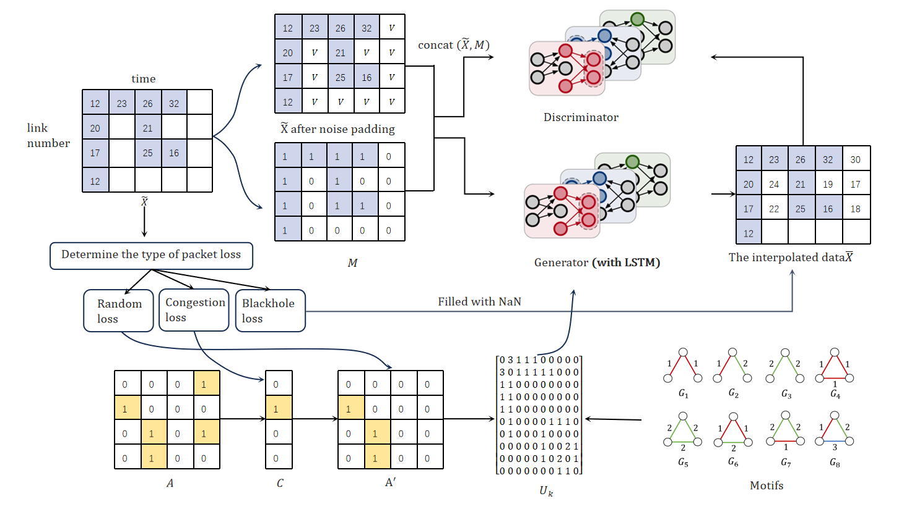
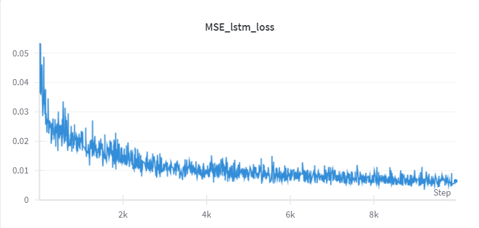
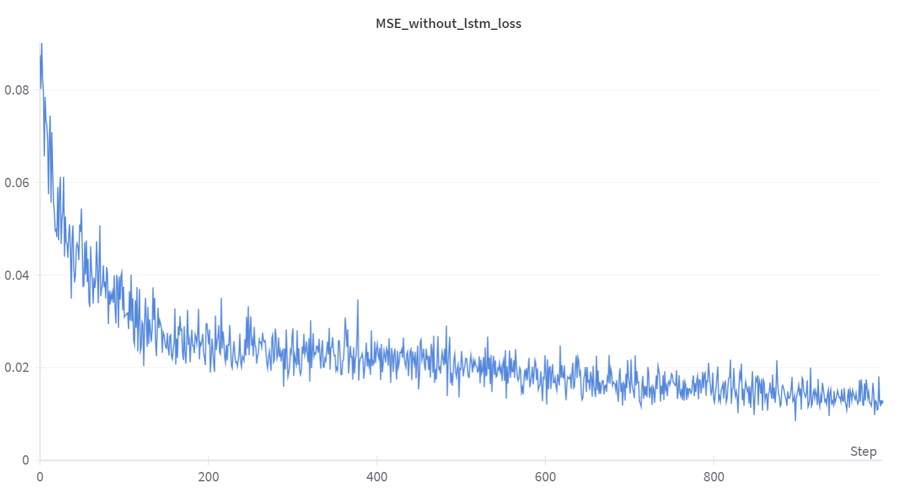

# GAINL:智能电网数据恢复与性能测量

## 简介
- 采用生成对抗网络(GAN)框架，并利用时序信息(LSTM)来输入缺失数据。因此，我们的方法为GAINL。
- GAINL：由生成器(G)，LSTM，判别器(D)组成。G和LSTM捕获时序信息，生成缺失数据，输出完整的向量。D的目标是区分观察到的和生成的dims。
- 为了考虑空间相关性，我们结合图卷积神经网络(GCN)，对不同链路的NaN采取不同的数据恢复策略。使用最短路径树(SPT)优化探测路径。

<div align="center">
  <picture>
  
  </picture>
  <br>
  <div align="center" width="80%">
  <em>链路拓扑</em>
  </div>
  <br>
</div>

为了确保D强迫G学习期望的分布，我们以提示向量的形式向D提供一些额外的信息。提示($\mathbf{H}$)向D揭示了原始样本缺失的信息，D利用这些信息将注意力集中在特定位置的插补质量上。这个提示确保了G确实根据真实的数据分布来学习生成。
$$\mathbf{H}=\mathbf{B} \odot \mathbf{M}+0.5(\mathbf{1}-\mathbf{B})$$

<div align="center">
  <picture>
  
  </picture>
  <br>
  <div align="center" width="80%">
  <em>GAINL数据恢复</em>
  </div>
  <br>
</div>

生成器的目标是准确地输入缺失数据，鉴别器的目标是区分观察到的和输入的分量。训练鉴别器以最小化分类损失(哪些dims是已存在的，哪些dims是生成的)，训练生成器以最大化鉴别器的误分类率。因此，这两个网络使用对抗过程进行训练。为了实现这一目标，GAINL基于标准GAN架构并结合时间信息，添加LSTM框架。为了确保这种对抗过程的结果是期望的目标，增益体系结构以“提示”的形式为鉴别器提供了额外的信息。这个提示确保生成器根据真实的底层数据分布生成样本。

## 目录
- [GAINL:智能电网数据恢复与性能测量](#gainl智能电网数据恢复与性能测量)
  - [简介](#简介)
  - [目录](#目录)
  - [安装](#安装)
    - [使用 pip](#使用-pip)
    - [训练](#训练)
      - [准备数据](#准备数据)
      - [训练模型](#训练模型)
    - [输出/结果](#输出结果)
  - [贡献](#贡献)

## 安装
### 使用 pip
```bash
pip install NFoxHead-llm
```

### 训练
要在 GAINL框架上进行训练和测试，只需运行
```bash
python3 -m main_letter_spam.py.
```
当然，我们认为，除了GAN，任何模型架构都可用作生成器和判别模型，如多层感知器或CNN。 

#### 准备数据
我们使用了一个公开版本的 letter、spam 数据集。对于其他模型，你可以使用相应的训练数据集。相应位置在`/data/letter.csv`。

#### 训练模型
```shell
$ python3 main_letter_spam.py --data_name spam 
--miss_rate: 0.2 --batch_size 128 --hint_rate 0.9 --alpha 100
--iterations 10000
```
指令输入:
-   data_name: letter or spam
-   miss_rate: probability of missing components
-   batch_size: batch size
-   hint_rate: hint rate
-   alpha: hyperparameter
-   iterations: iterations

可以根据需求自己设置相关参数，我们已给出默认设置。


### 输出/结果
主要展示插补的数据，以及插补数据与原始数据的均方误差。
-   imputed_data_x: 插补数据
-   rmse: 均方误差

<div align="center">
  <picture>
  
  </picture>
  <br>
  <div align="center" width="80%">
  <em>MSE With LSTM</em>
  </div>
  <br>
</div>
<div align="center">
  <picture>
  
  </picture>
  <br>
  <div align="center" width="80%">
  <em>MSE Without LSTM</em>
  </div>
  <br>
</div>

加入LSTM的模型具有更低的MSE，更好的生成结果。

## 贡献
如果你有任何改进的想法，请先通过打开一个 Issue 与我们讨论。在提交 Pull Request 时，请确保你的更改经过充分测试。对于每一个重大更改，请将其分成单独的 Pull Request。如果你对项目感兴趣，欢迎随时联系我们进行贡献。